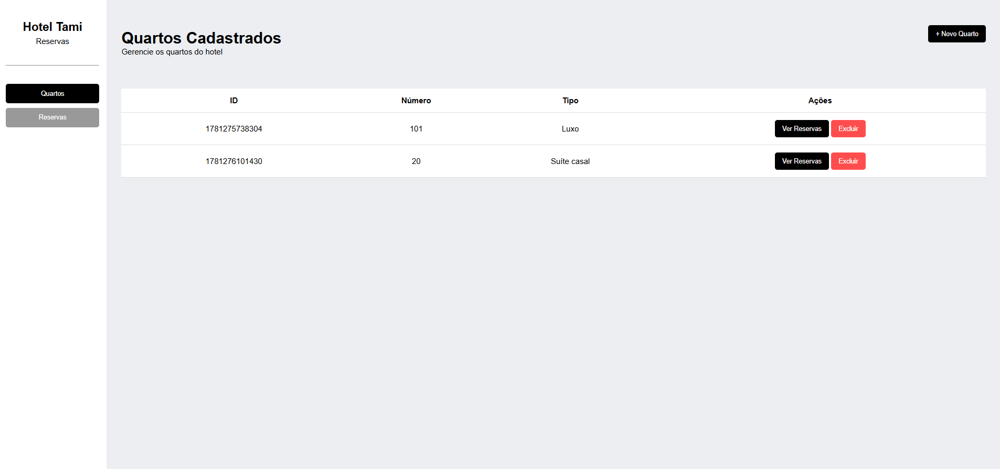

# Atividade
## Situação de aprendizagem desafiadora

## Objetivo

O objetivo é desenvolver um sistema web full-stack para gerenciamento de **quartos** e **reservas** de um hotel.

---

## Contextualização

O controle eficiente dos quartos e das reservas é fundamental para o funcionamento de hotéis, pousadas e hospedagens em geral. Muitas empresas ainda utilizam planilhas ou registros manuais para controlar informações dos hóspedes e dos quartos, o que dificulta a organização e a consulta dos dados.

Para solucionar esse problema, será desenvolvido um sistema web capaz de cadastrar quartos, visualizar informações dos quartos cadastrados, registrar reservas e consultar os dados armazenados em banco de dados.

---

# Protótipo da Interface

---

